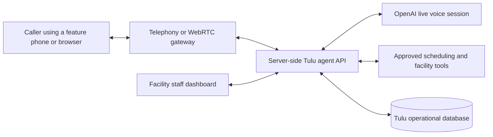

# Tulu

Tulu is a voice-led healthcare access project designed for communities where making a phone call is easier and more reliable than navigating a conventional application.

The long-term product lets someone call a Tulu access line from an ordinary mobile phone, speak naturally in a supported local language, and ask practical questions before making a long journey to a health facility. Tulu can then coordinate with verified facility information and authorized staff through a separate operations dashboard.

> **Current status:** the repository currently contains a functional, frontend-only caller simulation. It does not place a real phone call, capture microphone audio, connect to OpenAI, access facility records, or create a healthcare request.

## Why Tulu exists

Tulu was inspired by a visit to a remote part of Samburu, Kenya, where residents may travel many kilometres to reach the nearest health facility without knowing whether the relevant clinician, service, or medicine will be available when they arrive.

That uncertainty creates avoidable costs:

- A sick person may make a difficult journey and return without receiving help.
- Patients may not know whom to call at a facility or when staff will be available.
- Text-heavy applications exclude people using feature phones or people who are more comfortable speaking than typing.
- Facility staff may receive requests through disconnected, informal channels with no shared operational view.

Tulu explores a simpler entry point: **make a call, explain what you need, and let a voice agent coordinate the next steps.**

## Product surfaces

Tulu is separated into three deployable product surfaces plus a shared contract package.

| Surface | Audience | Responsibility | Status |
| --- | --- | --- | --- |
| Mobile caller simulation | Members of the public and hackathon judges | Demonstrates dialing, connecting, language selection, call controls, captions, and ending a call | Working frontend prototype |
| Facility dashboard | Authorized facility teams | Reviews incoming requests, updates operational information, confirms outcomes, and coordinates human follow-up | Workspace reserved |
| Agent API | Server-side infrastructure | Connects voice sessions to OpenAI, executes approved tools, authenticates users, and stores auditable state | Workspace reserved |
| Shared contracts | All Tulu applications | Holds common schemas, types, events, and case-status definitions | Workspace reserved |

The `mobile` application is a responsive web simulation rather than a native Android or iOS application. It is named after the caller-side experience and can be opened on both phones and desktop browsers.

## Current caller experience

The implemented prototype supports:

- A familiar 3 × 4 telephone keypad.
- A clearly synthetic Kenyan demo number.
- Empty, number-entered, calling, connected, and ended states.
- A simulated call timer and animated agent-presence indicator.
- Simulated mute, speaker, captions, and keypad controls.
- English and Kiswahili interface captions.
- In-call keypad shortcuts: `1` selects Kiswahili and `2` selects English.
- A final receipt that clearly states no real healthcare request was placed.
- Physical keyboard input for digits, Backspace, Enter, and Escape.
- Responsive layouts for compact phones, standard phones, and desktop demonstrations.
- Accessible labels, focus management, reduced-motion support, and large primary touch targets.

Every current call state is local browser state. Refreshing the application starts a new simulation.

## Target workflow

The intended end-to-end workflow is:

1. A caller reaches Tulu through a normal telephone call or the public web experience.
2. Tulu discloses that the caller is speaking to an AI system and asks for language and consent preferences.
3. The caller describes the access help they need.
4. The server-side agent checks approved sources such as facility schedules, service availability, or medicine inventory.
5. If information is missing, stale, sensitive, or requires authorization, Tulu sends the case to an appropriate staff member.
6. The facility dashboard shows the request and its current verification status.
7. An authorized staff member can confirm, reject, correct, or escalate the request.
8. Tulu communicates the verified result or creates a follow-up reference for the caller.

Tulu should never claim that an appointment is booked, medicine is available, a clinician is present, or emergency help has been dispatched unless an authoritative system or authorized staff member has confirmed that result.

## Target architecture



The browser applications must never contain the OpenAI API key or direct database credentials. They communicate with the trusted Agent API, which enforces authentication, authorization, validation, auditing, and tool-use policy.

## Repository structure

This repository uses a pnpm workspace so each product surface can evolve and deploy independently while remaining in one codebase.

```text
tulu-web/
├── apps/
│   ├── mobile/                 Public caller-side web simulation
│   │   ├── src/
│   │   │   ├── App.tsx         Call-state UI and interactions
│   │   │   ├── index.css       Responsive visual system
│   │   │   └── main.tsx        React entry point
│   │   ├── index.html
│   │   ├── package.json
│   │   └── vite.config.ts
│   └── main-dash/              Facility dashboard workspace
├── services/
│   └── agent-api/              Trusted server-side agent workspace
├── packages/
│   └── shared/                 Shared contracts and status definitions
├── package.json                Root scripts and runtime requirements
├── pnpm-lock.yaml              Reproducible dependency lockfile
└── pnpm-workspace.yaml         Workspace package discovery
```

## Technology currently in use

- React 19
- TypeScript 7
- Vite 8
- Lucide React icons
- pnpm workspaces
- Plain responsive CSS with no UI-framework dependency

Technology for the facility dashboard, persistence layer, and production agent service will be selected when those workspaces are implemented.

## Prerequisites

- Node.js `22.12.0` or newer
- pnpm `10.0.0` or newer

The repository records pnpm `10.28.1` as its expected package-manager version.

## Local development

Clone the repository and install dependencies from the workspace root:

```bash
git clone https://github.com/lisanyambere/TuluAI.git
cd TuluAI
pnpm install
```

Start the caller-side application:

```bash
pnpm dev
```

Vite will print the local development URL, normally `http://localhost:5173`.

## Available commands

Run all commands from the repository root.

| Command | Purpose |
| --- | --- |
| `pnpm dev` | Start the mobile caller simulation in development mode |
| `pnpm dev:mobile` | Explicit alias for the mobile development server |
| `pnpm build` | Build every workspace package that currently provides a build script |
| `pnpm build:mobile` | Build only the caller simulation |
| `pnpm preview:mobile` | Preview the caller's production build locally |
| `pnpm typecheck` | Type-check every workspace package that provides a typecheck script |

Before committing application changes, run:

```bash
pnpm typecheck
pnpm build
```

## Deployment model

The workspaces are intentionally separated so they can become different deployment projects.

### Caller simulation

- Application directory: `apps/mobile`
- Build from the workspace root: `pnpm build:mobile`
- Static output: `apps/mobile/dist`
- Intended access: public

### Facility dashboard

- Application directory: `apps/main-dash`
- Intended access: authenticated facility staff only
- Deployment configuration: to be added with the dashboard implementation

### Agent API

- Service directory: `services/agent-api`
- Intended access: server-to-server and authenticated application traffic
- Deployment configuration: to be added with the agent implementation
- OpenAI and infrastructure secrets must be stored only in the server environment or deployment platform's secret manager

When shared workspace packages are introduced, deployments should install dependencies from the repository root so `workspace:*` dependencies resolve correctly.

## Security, privacy, and clinical-safety boundaries

Tulu is an access-coordination system, not a medical professional or emergency service.

- Do not diagnose conditions or generate treatment instructions.
- Do not imply that emergency assistance has been dispatched without a verified external response.
- Do not expose OpenAI, database, telephony, or service credentials in either frontend.
- Collect only the minimum caller information needed for an explicitly stated purpose.
- Require clear consent before recording, retaining, or sharing sensitive call information.
- Separate unverified agent findings from staff-confirmed operational information.
- Show when facility information was last verified and treat stale records as unconfirmed.
- Require human review for sensitive, ambiguous, or high-impact actions.
- Keep tool actions auditable and use stable request identifiers to prevent duplicate bookings or escalations.
- Provide a clear path to a human staff member when the automated system cannot safely complete a request.

Production use will require local legal, clinical, privacy, data-retention, and emergency-response review before handling real patient information.

## Environment variables

The current caller simulation requires no environment variables.

Future secrets such as `OPENAI_API_KEY` must exist only in `services/agent-api` or the server platform's encrypted secret store. Never expose a secret through a variable prefixed with `VITE_`, because Vite embeds those values into browser-delivered JavaScript.

Public frontend configuration, such as an Agent API base URL, will be documented when the integration is implemented.

## Development roadmap

### Phase 1 — Caller interface

- [x] Responsive phone keypad
- [x] Simulated calling and connected states
- [x] In-call controls and timer
- [x] English and Kiswahili demo captions
- [x] End-of-call outcome receipt
- [x] Accessible focus and compact-screen behavior

### Phase 2 — Browser voice connection

- [ ] Secure session creation through the Agent API
- [ ] Live browser audio connection
- [ ] Spoken disclosure, language selection, and consent flow
- [ ] Reconnection and microphone-permission handling
- [ ] Visible transcript and tool-status events for demonstrations

### Phase 3 — Agent and operational tools

- [ ] Server-side OpenAI live voice integration
- [ ] Facility and service lookup tools
- [ ] Medicine-inventory freshness model
- [ ] Appointment-request and callback workflow
- [ ] Human handoff and escalation state machine
- [ ] Persistent, auditable case records

### Phase 4 — Facility dashboard

- [ ] Authentication and role-based access
- [ ] Live request queue
- [ ] Facility, clinician, service, and inventory updates
- [ ] Confirm, reject, correct, and escalate actions
- [ ] Operational alerts and response-time metrics

### Phase 5 — Telephone access and pilots

- [ ] PSTN/mobile-number integration
- [ ] Feature-phone testing
- [ ] Call-quality and language evaluations
- [ ] Low-connectivity and failure-mode testing
- [ ] Privacy, clinical-safety, and operational-readiness review

## Contributing

Keep changes scoped to the appropriate workspace:

- Caller-facing UI belongs in `apps/mobile`.
- Facility-facing UI belongs in `apps/main-dash`.
- Credentials, agent logic, and privileged tools belong in `services/agent-api`.
- Framework-neutral contracts shared between surfaces belong in `packages/shared`.

For every change:

1. Install dependencies from the repository root.
2. Avoid committing `.env` files, generated `dist` directories, or credentials.
3. Run `pnpm typecheck` and `pnpm build`.
4. Clearly label mock data and simulated outcomes.
5. Update this README when setup, architecture, or deployment behavior changes.
