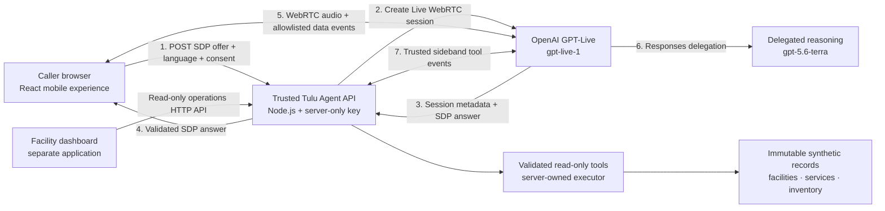

# Tulu

Tulu is a voice-led healthcare-access project for communities where making a phone call is easier and more reliable than navigating a conventional application.

The long-term product lets someone call a Tulu access line from an ordinary mobile phone, speak naturally in a supported local language, and ask practical questions before making a long journey to a health facility. Tulu can then coordinate with verified facility information and authorized staff through a separate operations dashboard.

> **Current status:** this repository contains a working browser-to-OpenAI voice slice, three read-only agent tools backed by an immutable fictional dataset, and a facility-dashboard workflow prototype. After explicit consent, the caller experience establishes a full-duplex WebRTC session with `gpt-live-1`; the trusted Node.js API keeps the OpenAI key server-side, delegates reasoning to `gpt-5.6-terra`, and owns privileged tool execution through an authenticated sideband. The dashboard currently prototypes staff request workflows with local synthetic state. This remains a controlled demo: it does not place or receive a PSTN/mobile-network call, connect to a real facility, persist healthcare requests, perform authoritative writes, or dispatch emergency help.

## Why Tulu exists

Tulu was inspired by a visit to a remote part of Samburu, Kenya, where residents may travel many kilometres to reach the nearest health facility without knowing whether the relevant clinician, service, or medicine will be available when they arrive.

That uncertainty creates avoidable costs:

- A sick person may make a difficult journey and return without receiving help.
- Patients may not know whom to call at a facility or when staff will be available.
- Text-heavy applications exclude people using feature phones or people who are more comfortable speaking than typing.
- Facility staff may receive requests through disconnected, informal channels with no shared operational view.

Tulu explores a simpler entry point: **make a call, explain what you need, and let a voice agent coordinate the next steps.**

## Product surfaces

Tulu is separated into three independently deployable product surfaces plus a shared contract package.

| Surface | Audience | Responsibility | Status |
| --- | --- | --- | --- |
| Mobile caller experience | Members of the public and hackathon judges | Simulates dialing a Tulu number and runs the real browser voice session | Working voice MVP |
| Facility dashboard | Authorized facility teams | Reviews requests, updates operational information, confirms outcomes, and coordinates human follow-up | Working local workflow prototype; synthetic data only |
| Agent API | Trusted server-side infrastructure | Creates GPT-Live sessions, owns sideband tool execution, and exposes synthetic operational reads | Working voice gateway plus read-only synthetic tools; no writes or persistence |
| Shared contracts | Mobile, dashboard, and Agent API | Defines Live-session, dashboard-request, and operational-data contracts | Implemented for the current voice, dashboard, and synthetic operations slices |

The `mobile` application is a responsive web experience rather than a native Android or iOS application. It can be opened on phones and desktop browsers. Today it uses an internet connection and browser WebRTC; later, a telephony provider or carrier integration can bridge an ordinary feature-phone call into the same trusted agent layer.

## Current caller experience

The implemented MVP supports:

- A familiar 3 × 4 telephone keypad and clearly synthetic Kenyan demo number.
- Empty, number-entered, dialing, connected, closing, ended, and failure states.
- An explicit pre-call consent sheet before the browser requests microphone access.
- English and Kiswahili interface choices and language-specific agent instructions.
- A real browser microphone stream and full-duplex GPT-Live audio over WebRTC.
- A spoken opening disclosure that identifies Tulu as an AI demonstration, not a doctor or emergency service, and states that it can check only fictional synthetic facility records.
- Live caller and Tulu captions from GPT-Live transcript events.
- Working microphone mute, output-speaker toggle, call timer, and graceful session close.
- In-call keypad shortcuts: `1` switches the agent to Kiswahili and `2` switches it to English.
- A final receipt that clearly states that no real healthcare request was placed.
- Physical keyboard input for digits, Backspace, Enter, and Escape.
- Responsive layouts, accessible labels, focus management, reduced-motion support, and large primary touch targets.

The dialing screen is intentionally a simulation of the future feature-phone experience. The voice conversation itself is real and chargeable through the configured OpenAI project, but it travels over the browser's internet connection—not a cellular voice number. Session and UI state remain ephemeral; refreshing the application starts over, and the current API does not store call content or cases. Facility, service, and inventory results are fictional fixtures and must not be used for travel or healthcare decisions.

## Current voice architecture

The OpenAI API key never reaches the browser. The browser creates a WebRTC SDP offer and posts it, along with the selected language and consent acknowledgement, to the Agent API. The API creates the Live session, immediately attaches a separate authenticated sideband WebSocket, and waits for that privileged channel to be ready before returning the SDP answer. A bounded attachment failure fails call setup instead of exposing a tool-enabled session with no executor. After that handshake, encrypted audio and permitted data-channel events flow directly between the browser and OpenAI; the Agent API is not a media relay.

The delegated Responses model may request one of three read-only functions: `find_facilities`, `check_service_availability`, or `check_inventory`. Only the server sees those nested tool-call events. It validates the arguments, queries the same synthetic repository used by the dashboard API, sends every function result over the sideband, and explicitly continues the delegated response. The browser cannot send tool outputs or continuation commands.



The session configuration allowlists only the client events needed by the caller UI. Direct backend-response and tool-result commands are not exposed to the browser. Prompts guide model behavior but are not an authorization or secrecy boundary; application code owns the tool allowlist, argument validation, result delivery, rate limits, and synthetic-data boundary. Real data and future writes still require staff authentication, authorization, idempotency, auditing, and human-review policy.

## Synthetic operations API

The Agent API exposes a small versioned read surface for the dashboard developer. It uses the exact same immutable repository as the voice tools, never contacts OpenAI, contains no patient fields, and is deliberately separate from the chargeable Live-session rate limit and Origin allowlist.

| Endpoint | Purpose | Query parameters |
| --- | --- | --- |
| `GET /api/v1/operations/snapshot` | Fetch the complete, small demo dataset for initial dashboard rendering | None |
| `GET /api/v1/operations/facilities` | Search fictional facilities | Optional `query`, optional integer `limit` from 1–20 |
| `GET /api/v1/operations/service-availability` | Check a named service | Required `service`; optional `facilityId`, `location` |
| `GET /api/v1/operations/inventory` | Check a named item | Required `item`; optional `facilityId`, `location` |

Every successful response includes `synthetic: true`, a fixed `verifiedAt` snapshot timestamp, `X-Tulu-Data-Mode: synthetic`, and `X-Tulu-Dataset-Version: 1`. Records also carry their own verification status, source, verification time, and validity window. Unknown or duplicate query fields are rejected instead of being ignored.

For example:

```bash
curl http://127.0.0.1:8787/api/v1/operations/snapshot
curl "http://127.0.0.1:8787/api/v1/operations/facilities?query=north%20ridge&limit=1"
curl "http://127.0.0.1:8787/api/v1/operations/service-availability?service=general%20consultation"
curl "http://127.0.0.1:8787/api/v1/operations/inventory?item=oral%20rehydration%20salts"
```

These unauthenticated endpoints are safe only while they return clearly labelled synthetic fixtures. Do not replace the repository with real operational or patient data until staff authentication, authorization, privacy controls, and a revised cache policy are implemented.

## Target operational workflow

The intended end-to-end workflow is:

1. A caller reaches Tulu through a normal telephone call or the public web experience.
2. Tulu discloses that the caller is speaking to an AI system and asks for language and consent preferences.
3. The caller describes the access help they need.
4. The trusted agent checks approved sources such as facility schedules, service availability, or medicine inventory.
5. If information is missing, stale, sensitive, or requires authorization, Tulu sends the case to an appropriate staff member.
6. The facility dashboard shows the request and its current verification status.
7. An authorized staff member can confirm, reject, correct, or escalate the request.
8. Tulu communicates the verified result or creates a follow-up reference for the caller.

Step 4 now works only against fictional fixture records. The dashboard demonstrates steps 6–7 locally, but no voice call creates a dashboard request yet, dashboard edits are not persisted, and caller follow-up remains future work. Tulu must never turn a synthetic lookup into a real-world claim, or claim that an appointment is booked, medicine is available, a clinician is present, or emergency help has been dispatched without an authoritative system or authorized staff member confirming it.

## Repository structure

This repository uses a pnpm workspace so each product surface can evolve and deploy independently while remaining in one codebase.

```text
tulu-web/
├── apps/
│   ├── mobile/                            Public caller-side web experience
│   │   ├── src/
│   │   │   ├── features/voice/
│   │   │   │   └── useLiveVoiceCall.ts   WebRTC and GPT-Live session lifecycle
│   │   │   ├── App.tsx                   Dialer, consent, call, and receipt UI
│   │   │   ├── index.css                 Responsive visual system
│   │   │   └── main.tsx                  React entry point
│   │   ├── index.html
│   │   ├── package.json
│   │   └── vite.config.ts                Local /api proxy to the Agent API
│   └── main-dash/                         Next.js facility dashboard prototype
│       ├── app/                            App Router pages and workflow states
│       ├── components/                     Queue, detail, facility, and shared UI
│       └── lib/mock-data.ts                Synthetic development data
├── services/
│   └── agent-api/
│       ├── src/
│       │   ├── live/                      OpenAI Live + trusted sideband orchestration
│       │   ├── operations/                Synthetic repository, tools, and read API
│       │   ├── prompts/                   Live and delegated-backend guardrails
│       │   ├── app.ts                     HTTP routes, validation, CORS, limits
│       │   ├── config.ts                  Server-only environment validation
│       │   └── server.ts                  Service composition and entry point
│       └── .env.example                   Safe configuration template
├── packages/
│   └── shared/
│       └── src/                            Voice and operational-data contracts
├── package.json                           Root scripts and runtime requirements
├── pnpm-lock.yaml                         Reproducible dependency lockfile
└── pnpm-workspace.yaml                    Workspace package discovery
```

## Technology currently in use

- React 19, TypeScript 7, and Vite 8 for the caller experience.
- Browser WebRTC (`RTCPeerConnection`, microphone media, and a data channel) for full-duplex voice.
- `gpt-live-1` for speech-to-speech interaction.
- OpenAI Responses delegation to `gpt-5.6-terra` for the separate reasoning backend.
- An authenticated OpenAI Live sideband WebSocket for server-owned function execution.
- Node.js 22, the OpenAI JavaScript SDK, `ws`, and the built-in Node HTTP server for the trusted Agent API.
- Shared TypeScript request/response contracts between the browser and API, with runtime validation at each trust boundary.
- An immutable, fictional Samburu-inspired fixture used by three read-only tools and the dashboard-facing operations API.
- Lucide React icons and plain responsive CSS with no UI-framework dependency.
- Node's built-in test runner with mocked OpenAI responses for repeatable API tests.
- Next.js App Router, React, TypeScript, and plain responsive CSS for the facility dashboard prototype.

Technology for the facility dashboard is being developed separately. Persistent operational data, authenticated writes, real facility integrations, and PSTN access have not yet been implemented.

## Prerequisites

- Node.js `22.12.0` or newer.
- pnpm `10.0.0` or newer. The repository records pnpm `10.28.1` as its expected version.
- An OpenAI project-scoped API key with access to the configured Live and Responses models.
- A browser with WebRTC and microphone support.
- `localhost` during development or HTTPS in deployment; browsers require a secure context for microphone access.

## Local development

Clone the repository and install dependencies from the workspace root:

```bash
git clone https://github.com/lisanyambere/TuluAI.git
cd TuluAI
pnpm install
```

Create the Agent API's local environment file:

```bash
cp services/agent-api/.env.example services/agent-api/.env
```

Add the project service-account key only to `services/agent-api/.env`:

```dotenv
OPENAI_API_KEY=your-project-service-account-key
```

Never put this key in `apps/mobile`, prefix it with `VITE_`, paste it into browser code, log it, or commit the `.env` file. Vite exposes `VITE_*` variables to browser-delivered JavaScript.

Start the caller app, Agent API, and facility dashboard together:

```bash
pnpm dev
```

The mobile app normally opens at `http://localhost:5173`, the facility dashboard at `http://localhost:3000`, and the Agent API listens at `http://127.0.0.1:8787`. Vite proxies local `/api` requests to the Agent API. Open the mobile URL, dial or select the demo line, review the consent notice, continue, and allow microphone access when the browser asks.

You can confirm that the service is running without creating a chargeable voice session:

```bash
curl http://127.0.0.1:8787/health
```

## Available commands

Run all commands from the repository root.

| Command | Purpose |
| --- | --- |
| `pnpm dev` | Start the Agent API and mobile app together |
| `pnpm dev:stack` | Explicit alias for the full local stack |
| `pnpm dev:agent` | Start only the Agent API |
| `pnpm dev:mobile` | Start only the caller app |
| `pnpm test` | Run tests in every workspace that provides them |
| `pnpm test:agent` | Run the Agent API's mocked unit and HTTP tests |
| `pnpm typecheck` | Type-check every workspace package that provides a typecheck script |
| `pnpm build` | Build every workspace package that provides a build script |
| `pnpm build:agent` | Build the shared package and Agent API |
| `pnpm build:mobile` | Build only the caller app |
| `pnpm preview:mobile` | Preview the caller's production build locally |

Before committing application changes, run:

```bash
pnpm test
pnpm typecheck
pnpm build
```

The automated Agent API tests mock OpenAI; they validate Tulu's request handling and OpenAI SDK configuration without opening a billable live session. A real end-to-end voice check still requires the configured key, internet access to the OpenAI API, browser microphone permission, and a supported browser.

## Environment variables

### Agent API

Store these values in `services/agent-api/.env` for local development or in the server platform's encrypted secret store for deployment.

| Variable | Required | Default or constraint | Purpose |
| --- | --- | --- | --- |
| `OPENAI_API_KEY` | Yes | No default | Server-only project service-account key |
| `OPENAI_LIVE_MODEL` | No | Must be `gpt-live-1` for this MVP | Full-duplex voice model |
| `OPENAI_BACKEND_MODEL` | No | Must be `gpt-5.6-terra` for this MVP | Responses-delegation model |
| `HOST` | No | `127.0.0.1` | API bind address |
| `PORT` | No | `8787` | API port |
| `WEB_ORIGINS` | No | Local mobile Vite and preview origins | Exact browser origins allowed to create chargeable Live sessions |
| `OPERATIONS_WEB_ORIGINS` | No | Local Next.js dashboard origin on port 3000 | Exact dashboard origins allowed to read the synthetic operations API |
| `RATE_LIMIT_WINDOW_MS` | No | `60000` | In-memory session-request window |
| `RATE_LIMIT_MAX` | No | `6` | Maximum session creations per address per window |
| `OPERATIONS_RATE_LIMIT_WINDOW_MS` | No | `60000` | Independent in-memory operations-read window |
| `OPERATIONS_RATE_LIMIT_MAX` | No | `120` | Maximum synthetic operations reads per address per window |
| `TRUST_PROXY` | No | `false` | Trust the first forwarded client address only behind a proxy you control |

### Mobile app

| Variable | Required | Default | Purpose |
| --- | --- | --- | --- |
| `VITE_AGENT_API_URL` | No | Empty; local Vite proxy | Public base URL of the deployed Agent API when the two surfaces use different origins |

Only public configuration belongs in a `VITE_*` variable. For a separate production deployment, build the mobile app with `VITE_AGENT_API_URL` set to the HTTPS Agent API origin and add the mobile app's exact HTTPS origin to `WEB_ORIGINS`. Add the dashboard's origin to `OPERATIONS_WEB_ORIGINS`; adding it there does not grant permission to create chargeable voice sessions.

## Deployment model

The workspaces are separated so the caller experience, facility dashboard, and API can become different deployment projects.

### Caller experience

- Application directory: `apps/mobile`
- Build from the workspace root: `pnpm build:mobile`
- Static output: `apps/mobile/dist`
- Intended access: public over HTTPS
- Runtime dependency: an HTTPS Agent API reachable through `VITE_AGENT_API_URL` or a same-origin reverse proxy

### Facility dashboard

- Application directory: `apps/main-dash`
- Intended access: authenticated facility staff only
- Status: local workflow prototype; Auth0, request persistence, and authenticated staff writes are pending

### Agent API

- Service directory: `services/agent-api`
- Build from the workspace root: `pnpm build:agent`
- Start the compiled service: `pnpm --filter @tulu/agent-api start`
- Intended access: the caller frontend for Live-session creation, the dashboard for synthetic read-only operations, and authenticated application/server traffic later
- Secrets: server environment or the deployment platform's encrypted secret manager only

Install dependencies from the repository root in every deployment so `workspace:*` packages resolve correctly.

The current Origin allowlists and separate single-process, IP-based rate limiters are useful MVP guardrails, but **they are not production authentication, authorization, quota enforcement, or abuse prevention**. Before exposing session creation publicly, add a signed or authenticated short-lived session grant, per-user and global quotas backed by shared storage, spend alarms, abuse monitoring, HTTPS, audit-safe structured logs, correct trusted-proxy configuration, and session lifecycle controls. Privileged tool results already use the trusted sideband; move the remaining application-authored instruction/commentary commands off the browser before treating them as trusted context.

## Security, privacy, and clinical-safety boundaries

Tulu is an access-coordination demonstration, not a medical professional or emergency service.

- Use synthetic demo information only; do not share real patient or health details in this MVP.
- Microphone audio is sent to OpenAI after the caller explicitly continues through the consent sheet and grants browser permission.
- Do not diagnose conditions or generate treatment, prescription, or dosage instructions.
- Do not imply that emergency assistance has been dispatched without a verified external response.
- Do not expose OpenAI, database, telephony, or service credentials in either frontend.
- Collect only the minimum caller information needed for an explicitly stated purpose.
- Require appropriate consent and policy review before recording, retaining, or sharing sensitive call information. The current consent sheet is an MVP interaction, not a substitute for legal review.
- Separate unverified agent output from staff-confirmed operational information.
- Show when facility information was last verified and treat stale records as unconfirmed.
- Require human review for sensitive, ambiguous, or high-impact actions.
- Keep tool actions auditable and use stable request identifiers to prevent duplicate bookings or escalations.
- Provide a clear path to a human staff member when the automated system cannot safely complete a request.

The current prompts permit only clearly labelled synthetic lookups. They prohibit the agent from presenting those records as real, contacting staff, booking an appointment, recommending medicine, or dispatching help. Production use requires local legal, clinical, privacy, data-retention, security, and emergency-response review before handling real patient information.

## Development roadmap

### Phase 1 — Caller interface

- [x] Responsive phone keypad
- [x] Dialing, connected, failure, and ended states
- [x] In-call controls and timer
- [x] English and Kiswahili interface copy
- [x] End-of-call outcome receipt
- [x] Accessible focus and compact-screen behavior

### Phase 2 — Browser voice connection

- [x] Server-side Live-session creation that keeps the OpenAI key out of the browser
- [x] Full-duplex browser audio over WebRTC
- [x] Explicit consent and spoken AI/clinical-safety disclosure
- [x] English and Kiswahili live prompt variants and in-call switching
- [x] Microphone-permission, connection, and API error handling
- [x] Live caller and agent captions
- [x] Real mute, speaker, and graceful close behavior
- [ ] Automatic reconnection and network recovery
- [ ] Broader device, browser, call-quality, and language evaluation

### Phase 3 — Agent and operational tools

- [x] `gpt-live-1` session with Responses delegation to `gpt-5.6-terra`
- [x] Separate Live and backend safety prompts
- [x] Trusted sideband connection for server-controlled tool orchestration
- [x] Synthetic facility and service lookup tools
- [x] Synthetic inventory records with verification and validity metadata
- [x] Read-only, dashboard-consumable operations API
- [ ] Authenticated real facility-data integration
- [ ] Appointment-request and callback workflow
- [ ] Human handoff and escalation state machine
- [ ] Persistent, auditable case records

### Phase 4 — Facility dashboard

- [ ] Authentication and role-based access
- [x] Local synthetic request queue and filters
- [x] Local facility information editing workflow
- [x] Confirm, reject, clarify, escalate, and resolve demo actions
- [x] Assignment, notes, and audit-trail demo workflows
- [ ] Live request queue backed by persistent data
- [ ] Facility, clinician, service, and inventory updates through trusted tools
- [ ] Operational alerts and response-time metrics

### Phase 5 — Telephone access and pilots

- [ ] PSTN/mobile-number integration
- [ ] Feature-phone testing
- [ ] Call-quality and language evaluations
- [ ] Low-connectivity and failure-mode testing
- [ ] Privacy, clinical-safety, and operational-readiness review

## OpenAI implementation references

- [Connect GPT-Live from a browser with WebRTC](https://developers.openai.com/api/docs/guides/voice-webrtc?api=live)
- [Delegate GPT-Live reasoning to the Responses API](https://developers.openai.com/api/docs/guides/live-delegation)
- [Manage Live conversations and server events](https://developers.openai.com/api/docs/guides/live-conversations)
- [Add server-side controls with a trusted sideband](https://developers.openai.com/api/docs/guides/voice-server-controls?api=live)
- [Prompting guidance for voice agents](https://developers.openai.com/api/docs/guides/live-prompting)
- [`gpt-live-1` model reference](https://developers.openai.com/api/docs/models/gpt-live-1)

## Contributing

Keep changes scoped to the appropriate workspace:

- Caller-facing UI and unprivileged WebRTC lifecycle code belong in `apps/mobile`.
- Facility-facing UI belongs in `apps/main-dash`.
- Credentials, privileged prompts, agent policy, and operational tools belong in `services/agent-api`.
- Framework-neutral contracts shared between surfaces belong in `packages/shared`.

For every change:

1. Install dependencies from the repository root.
2. Avoid committing `.env` files, generated `dist` directories, or credentials.
3. Run `pnpm test`, `pnpm typecheck`, and `pnpm build`.
4. Clearly label mock data and simulated outcomes.
